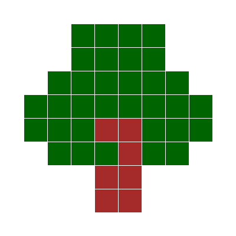

# Snap-It Card Generator

[Snap-It Cubes](https://www.amazon.com/Learning-Resources-Mathlink-Educational-Counting)
are a popular addition to pre-k and kindergarten classrooms and playrooms. They help to
teach kids patterns, following patterns from images, and math.

Teachers online sometimes sell [Snap-It Cards](https://www.teacherspayteachers.com/Product/Back-To-School-Snap-Cubes-Activity-Mats-Task-Cards-4748784?st=d1761c8c35efe370bb1fd9686edfc76c),
which have simple, colored images for kids to recreate using their Snap-It blocks. For my 
younger sister, I created a simple CLI that allows parents and teachers to download a
simple clip art image off the internet, pixelize it, convert the colors into those that
match the colors available, and then download the resulting image as a grid.

## Usage

You need Python3.X, Pillow, and numpy. Clone or download the repository. To generate a 
10x10 image, you can use, where you supply the path of the source image (`tree.png`) and 
the path of the output image (`out.png`).

```
python generator.py tree.png out.png
```

which converts


to



### Tips

For best results, use very simple images, such as clip art, with minimal colors and
preferrably no outline. Use a square or close to square image. You may have to attempt 
with multiple images in order to get the best results. At the moment, you cannot use
images with transparent pixels (try converting to jpg beforehand).

### More options

You can specify the amount of pixels you'd like by specifying

```
python generator.py tree.png out.png --dims 15
```

which will generate a 15x15 image. The default is 10x10.

To auto display the image after output, use the flag `--show true` at the end.